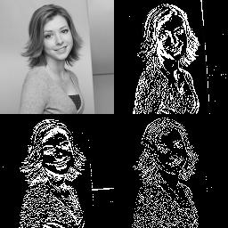

# Discrete Haar Wavelet Transform

] <p/>

 <p/>

Based on code from:<br/>
  https://www.codeproject.com/Articles/683663/Discrete-Haar-Wavelet-Transformation


## Prerequisites

* .NET9 SDK


## Getting started

```bash
git clone https://github.com/TrevorDArcyEvans/DWTSharp.git
cd DWTSharp
dotnet restore
dotnet build
dotnet test
```

## Further work
* add `iterations` as a command line parameter
